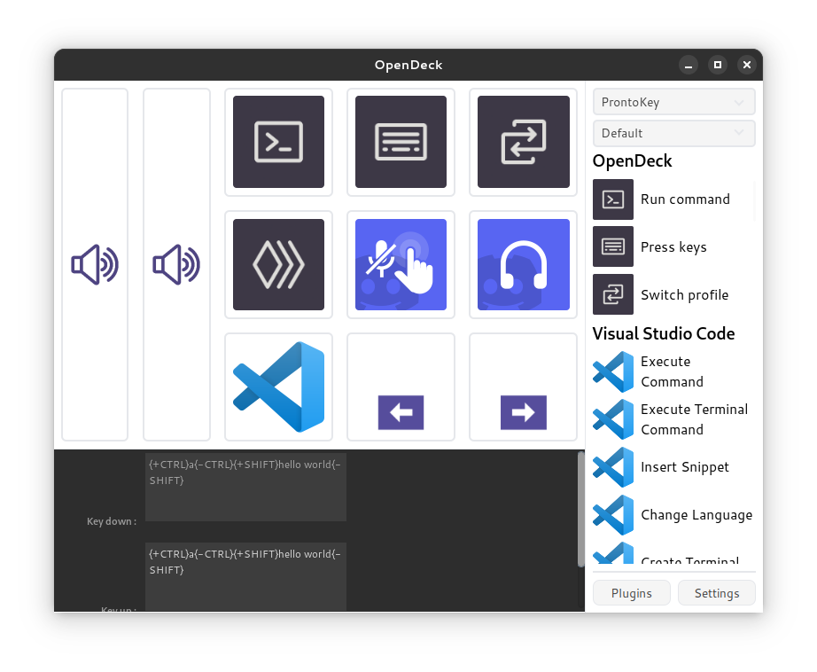
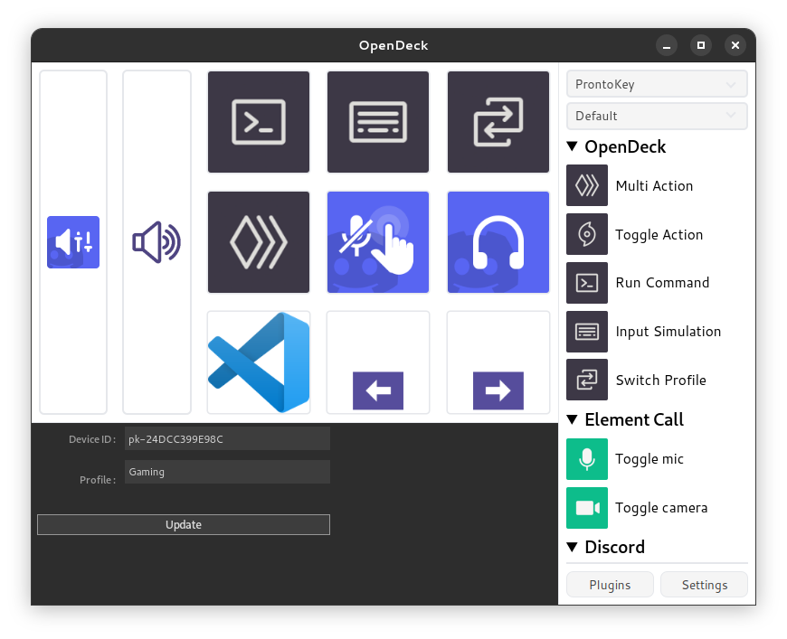
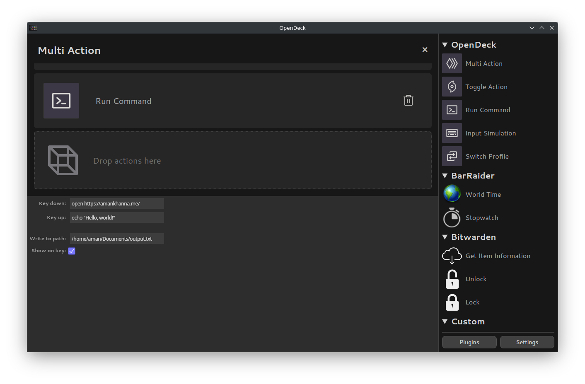
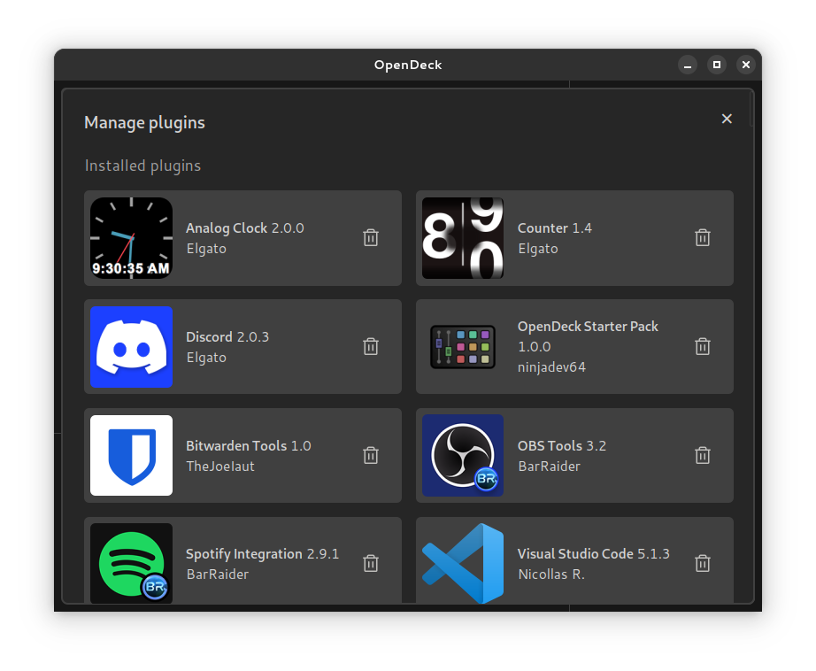
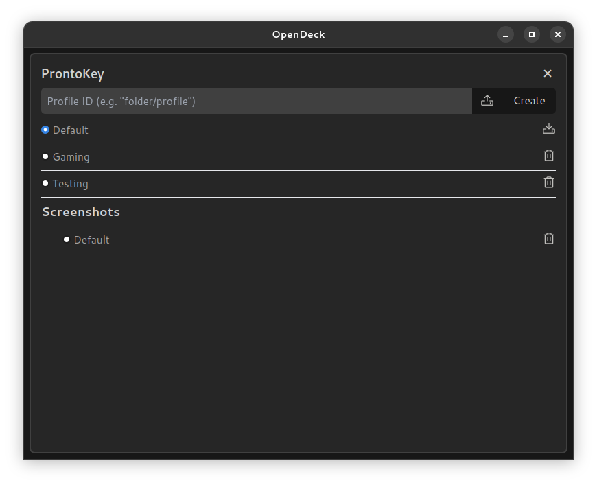

# OpenDeck

OpenDeck is a desktop application for using stream controller devices like the Elgato Stream Deck. OpenDeck conforms to the [OpenAction](https://openaction.amankhanna.me/) API, which is cross-compatible with the Stream Deck SDK, allowing a wide range of plugins made for Elgato's first-party Windows and macOS software to be used.

OpenDeck supports ProntoKey, Elgato Stream Deck and some Ajazz hardware on all three major desktop platforms. If you would like to contribute support for additional hardware (e.g. Loupedeck) feel free to reach out on any of the support forums and make a pull request!

If you would like to support development of OpenDeck, consider [sponsoring me](https://github.com/sponsors/ninjadev64) on GitHub Sponsors!

Special thanks go to the developers of [Tauri](https://github.com/tauri-apps/tauri), [elgato-streamdeck](https://github.com/streamduck-org/elgato-streamdeck), [Wine](https://www.winehq.org/), and [Phosphor Icons](https://phosphoricons.com/).

## Installation

### GNU+Linux

- Download the latest release from GitHub Releases.
	- You should avoid AppImage releases of OpenDeck as they tend to have problems (you should also just avoid AppImages in general).
	- For users of Arch-based distributions, there is the `opendeck` AUR package for the latest release, as well as the `opendeck-git` AUR package for the latest commit on the `main` branch of this repository.
- Install OpenDeck using your package manager of choice.
- Install the appropriate udev subsystem rules from [here](https://raw.githubusercontent.com/streamduck-org/elgato-streamdeck/main/40-streamdeck.rules):
	- If you're using a `.deb` or `.rpm` release artifact, this file should be installed automatically.
	- Otherwise, download and copy it to the correct location with `sudo cp 40-streamdeck.rules /etc/udev/rules.d/`.
	- In both cases, you will need to reload your udev subsystem rules with `sudo udevadm control --reload-rules`.
- If you intend to use plugins that are only compiled for Windows or macOS (which are the majority of plugins), you will need to have [Wine](https://www.winehq.org/) installed on your system. Some plugins may also depend on Wine Mono (which is sometimes, but not always included, in your distro's packaging of Wine).

### Windows

- Download the latest release (`.exe` or `.msi`) from GitHub Releases.
- Double-click the downloaded file to run the installer.

### macOS

- Download the latest release from GitHub Releases.
- If you downloaded a `.dmg`, open the downloaded disk image and drag the application inside into your Applications folder; otherwise, extract the `.tar.gz` to your Applications folder.
- Open the installed application. Note: if you receive a warning about OpenDeck being distributed by an unknown developer, *right-click the app in Finder and then click Open* to suppress the warning.
- If you intend to use plugins that are only compiled for Windows, you will need to have [Wine](https://www.winehq.org/) installed on your system.

## Support

### How do I...?

To view or modify an action's settings, left-click on it to display its property inspector. To remove an action, right-click on it and choose "Delete" from the context menu.

To edit an action's appearance, right-click on it and select "Edit" in the context menu. You should then be able to customise the image and title of each of its states. To choose an image from your device: left-click on the image, to reset it to the plugin-provided default: right-click on the image, and to remove the image entirely: CTRL+right-click on the image.

To select another device, or to view or switch profiles, use the dropdowns in the top right corner. You can organise profiles into group-like folders by prefixing the profile name with the folder name and a forward slash.

To enable automatic launch on startup, the light theme, to change the language plugins are localised in, or to modify other options, open Settings. From here, you can also view information about your version of OpenDeck or open the configuration and log directories. To add or remove plugins, visit the Plugins tab.

### Troubleshooting

- Ensure you are running the latest version of OpenDeck, as well as recent versions of related software (e.g. Spotify or OBS, or your operating system and Wine).
- Check the pinned [GitHub Issues](https://github.com/ninjadev64/OpenDeck/issues) to see if there's a fix for your problem already.
- Check the OpenDeck log file for any important messages. This file should be included with any support request.
	- You can also run OpenDeck from the terminal to see the logs directly if it's easier than finding the log file or if the log file is empty or missing details.
	- For issues with plugins, you can also check the plugin's logs (in the same folder, sometimes as well as a file named `plugin.log` or similar in the plugin's own folder).
	- The log directory can be opened from the settings page of OpenDeck, or alternatively located manually at the paths below:
		- GNU+Linux: `~/.local/share/opendeck/logs/`
		- Flatpak: `~/.var/app/me.amankhanna.opendeck/data/opendeck/logs/`
		- Windows: `%appdata%\opendeck\logs\`
		- macOS: `~/Library/Logs/opendeck/`
- When trying to run Windows-only plugins (which are the majority of plugins) on GNU+Linux or macOS, please ensure you have the latest version of Wine (and Wine Mono) installed on your system.
- If your device isn't showing up, ensure you have the correct permissions to access it, and that you have restarted OpenDeck since connecting it.

### Support forums

- [Discord](https://discord.gg/26Nf8rHvaj)
- [Matrix](https://matrix.to/#/#opendeck:amankhanna.me)
- [GitHub Issues](https://github.com/ninjadev64/OpenDeck/issues)

### Building from source / contributing

You'll need to ensure that all of the [prerequisites for building a Tauri application](https://tauri.app/start/prerequisites) are satisfied to build OpenDeck, as well as making sure that [Deno](https://deno.com/) is installed. On GNU+Linux, you'll also need `libudev` installed for your distribution. You can then use `deno task tauri dev` and `deno task tauri build` to work with OpenDeck.

Before each commit, please ensure that all of the following are completed:
1. Rust code has been linted using `cargo clippy` and it discovers no violations
2. Rust code has been formatted using `cargo fmt`
3. TypeScript code has been linted using `deno lint` and it discovers no violations
4. Svelte code has been linted using `deno task check` and it discovers no violations
5. Frontend code has been formatted using `deno fmt --unstable-component`

Feel free to reach out on the support channels above for guidance when contributing!

OpenDeck is licensed under the GNU General Public License version 3.0 or later. For more details, see the LICENSE.md file.

## Showcase

