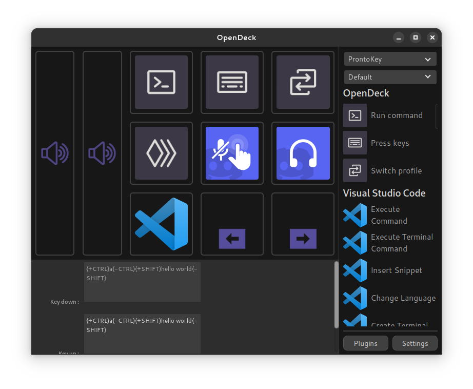

# OpenDeck

OpenDeck is a desktop application for interfacing between human interface devices with keys or encoders and plugins, which provide actions to be carried out when the user interacts with the device. OpenDeck conforms to the [OpenAction](https://openaction.amansprojects.com/) API, which is cross-compatible with the Stream Deck SDK, allowing a wide range of pre-existing plugins to be used.

OpenDeck supports ProntoKey and Elgato Stream Deck hardware on all three major desktop platforms. If you would like to contribute support for additional hardware (e.g. Loupedeck) feel free to reach out on any of the support forums and make a pull request!

## Installation

### GNU+Linux

- Download the latest release from GitHub Releases.
- Install OpenDeck using your package manager of choice.
- If using Elgato hardware, install the appropriate udev subsystem rules from [here](https://raw.githubusercontent.com/streamduck-org/elgato-streamdeck/main/40-streamdeck.rules):
	- `cp 40-streamdeck.rules /etc/udev/rules.d/`
	- `sudo udevadm control --reload-rules`

### Windows

- Download the latest release from GitHub Releases.
- Double-click the downloaded file to run the installer.

### macOS

- Download the latest release from GitHub Releases.
- Open the downloaded disk image and drag the application inside into your Applications folder.
- Open the installed application. Note: if you receive a warning about OpenDeck being distributed by an unknown developer, *right-click the app in Finder and then click Open* to suppress the warning.

## Showcase

## Support

### Solutions to frequent problems

- Check the OpenDeck log file for any important messages. This file should be included with any support request.
	- GNU+Linux: `~/config/com.amansprojects.opendeck/logs/`
	- Windows: `%appdata%/com.amansprojects.opendeck/logs`
	- macOS: `~/Library/Application Support/com.amansprojects.opendeck/logs`
- When trying to run Windows-only plugins (which are the majority of plugins) on GNU+Linux or macOS, please ensure you have the latest version of Wine installed on your system.
- If your device isn't showing up, ensure you have the correct permissions to access it, and that you have restarted OpenDeck since connecting it.

### Support forums

- [Discord](https://discord.gg/26Nf8rHvaj)
- [Matrix](https://matrix.to/#/#opendeck:amansprojects.com)
- [GitHub Issues](https://github.com/ninjadev64/OpenDeck/issues)

### Building from source / contributing

You'll need to ensure that all of the [prerequisites for building a Tauri application](https://tauri.app/v1/guides/getting-started/prerequisites) are satisfied to build OpenDeck (this includes the Tauri CLI from `cargo install tauri-cli`). On GNU+Linux, you'll also need `libudev` installed for your distribution. Then, ensure that the required frontend dependencies are installed with `npm i(nstall)`. You can then use `cargo tauri dev` and `cargo tauri build` to work with OpenDeck.

When submitting a pull request, ensure that all of your Rust code has been formatted using `cargo fmt`, `cargo clippy` returns no violations, and modified Svelte code sticks to the existing style used as far as possible. Feel free to reach out on the support channels above for guidance when contributing!
