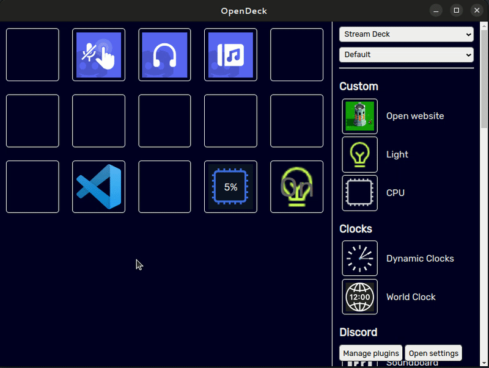
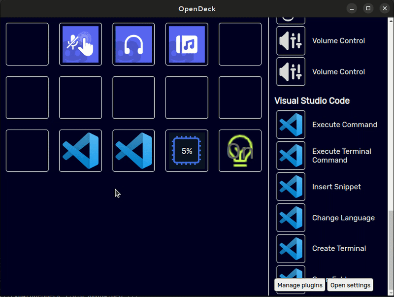
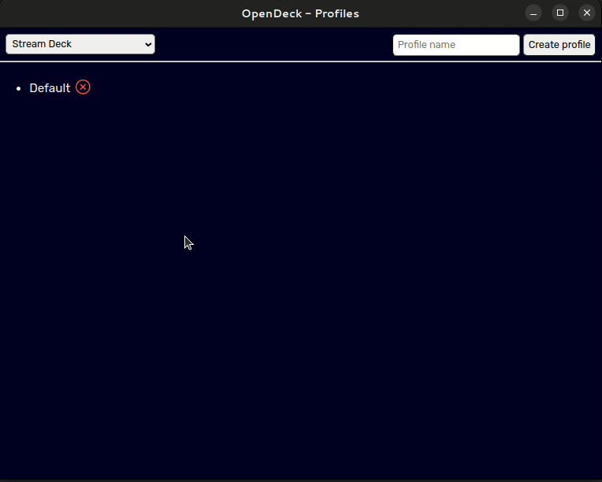
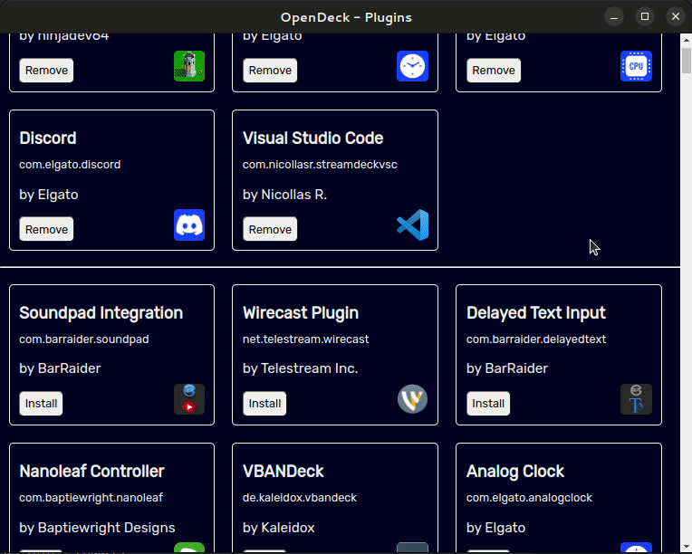

## OpenDeck

OpenDeck is a desktop software that allows Stream Deck-like functionality, implementing the Elgato Stream Deck SDK for cross-compatibility.

The software is supported on Windows, macOS, and Linux, and is built with Electron. The software is designed for ProntoKey hardware (USB and Bluetooth), but also supports Elgato hardware (thanks to the `@elgato-stream-deck/node` package by julusian).

Join the [Discord server](https://discord.gg/26Nf8rHvaj) for questions, support, and updates!

### Installation

1. Download a pre-built distributable for your platform from GitHub Actions [here](https://github.com/ninjadev64/OpenDeck/actions).
2. If you're using Elgato hardware on Linux, apply the required udev subsystem rules as described [here](https://github.com/Julusian/node-elgato-stream-deck#linux).
3. If you're using ProntoKey hardware on Windows, install the CP210x Universal Windows Driver from [here](https://www.silabs.com/developers/usb-to-uart-bridge-vcp-drivers?tab=downloads). 
4. If you're using ProntoKey hardware over Bluetooth, switch to Bluetooth mode in OpenDeck settings.

### Updating

1. Terminate OpenDeck if it's running with `killall opendeck`.
2. If the update to be installed is a breaking config change, nuke your config file. Not all updates will require this. (this will remove all settings and profiles)
	- On Windows, the file is located at `%appdata%/opendeck/config.json`.
	- On macOS, the file is located at `~/Library/Application Support/opendeck/config.json`.
	- On Linux, the file is located at `~/.config/opendeck/config.json`.
3. Install the new version by performing the installation steps.

### Usage

### Structure

The OpenDeck codebase is modular and aims to keep independent areas seperate, for the most part. Seperate "modules" handle serial communication with the hardware, plugin loading and lifecycle, property inspectors, settings/data persistency, etc.

`main.ts` contains all Electron-specific code - it creates the main browser window, handles application lifecycle, and loads the individual modules specified below on startup.

`shared.ts` provides helper functions for dealing with action contexts and profiles. It does not depend on any other module (save for `store.ts`), so can be used from anywhere.

`devices.ts` handles communication with the hardware, via any supported means. It handles incoming data from the hardware and triggers `event.ts` appropriately.

`plugins.ts` loads plugins at startup and manages their lifecycle. It triggers `event.ts` for inbound events.

`propertyinspector.ts` facilitates action [property inspectors](https://docs.elgato.com/sdk/plugins/property-inspector), and also triggers `event.ts`.

`event.ts` facilitates handling inbound events and sending outbound events to/from plugins and property inspectors. It can be used from anywhere, however, it may have to be imported late in some modules to prevent a circular dependency.

`store.ts` contains the schema and store instance for the `electron-store` module. It is used to persist user settings and profiles.

### Renderer codebase

The Electron renderer codebase is also modular.

`renderer.js` manages the main window, where the user can update the action assigned to each slot, open their property inspectors (by triggering `propertyinspector.ts` via IPC), and open the plugin store or settings window. This file communicates solely via IPC and does not use the store.

`profiles.js` manages the profile manager window, where the user can create or delete profiles. This file uses the store and IPC.

`settings.js` manages the settings window. This file uses the store.

`pluginstore.js` provides an interface for users to select and install plugins from Elgato Apps. This file, albeit minimally, uses the store.

### Slots, actions, states, instances, and contexts

A *slot* is a key or a slider, that can be assigned an action.

An *action* is provided by a plugin, and specifies a name, icon, tooltip, etc. An action can have multiple *states*, e.g. "On", "Off", or "Muted", "Unmuted", etc.

Every slot is assigned an *instance* of an action, that has its own individual settings. An instance is identified by a *context*, which in OpenDeck is in the format of `device.profile.type.position.index`.

`device`: a string identifying the device. ProntoKey devices are prefixed with `pk-` and Elgato devices are prefixed with `sd-`.

`profile`: a string identifying the profile. It is generated based on the time the profile was created and a random number.

`type`: a string enum that can be either "key" or "slider".

`position`: an integer that designates which key or slider the instance is assigned to.

`index`: this specifies the order the action should be triggered in if the key or slider contains a multi-action.

Example: `pk-D4:D4:DA:E4:79:5E.lldr3mliu9vfj083d1l.key.0.0`

### Running and building

This project uses npm to manage dependencies. You can use `npm run start` while developing, and to package the application using Electron Forge, use `npm run make`.